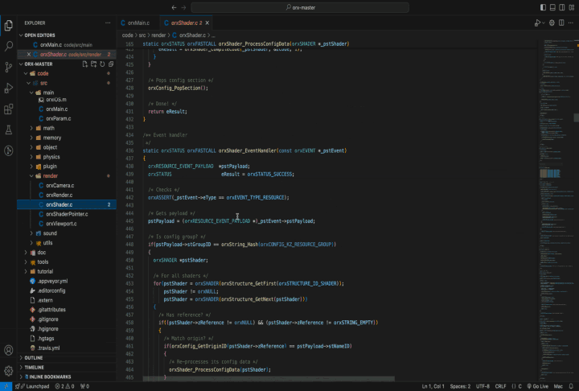
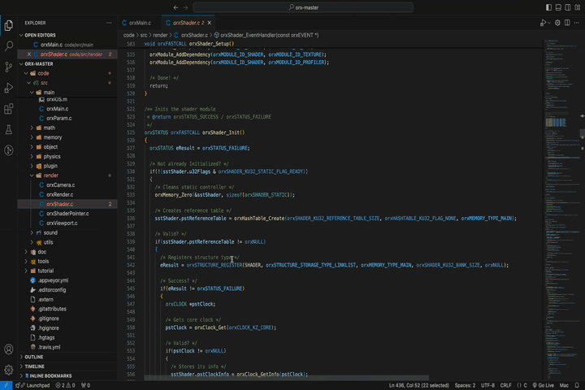

# 🌟 RigVe 🌟

## 🖥️ Unleashing the Beauty of Code

RigVe transforms complex code into visually stunning diagrams that are not just easy to understand but also a delight to look at. Whether you’re debugging, presenting, or exploring your code, RigVe turns every line into a work of art. 🎨

In the modern era of software development, understanding the intricate flow of code is essential. RigVe bridges the gap between abstract code and intuitive design by converting your code into meaningful, colorful diagrams that speak volumes at a glance.

## 📽️ Demo
### Sequence Diagram
This diagram explains about the function and its function calls to the file definiton is available recursively

### Nassi–Shneiderman Diagram

This will explains abot the function using NSD symbols and colors for similar colors for the same group symbols

### Dependency Diagram

This diagram show the header files included recursively

## The Power of Visualization

In a world where a picture is worth a thousand words, RigVe takes it a step further—turning your code into a visual narrative that’s easy to understand, analyze, and share. Uncover patterns, identify bottlenecks, and streamline your development process with the power of visualization.

### ✨ Visual Clarity
Transform complex code structures into clear, visually engaging diagrams.

### 🖱️ Interactive Diagrams
Not just static images, The diagrams allow you to interact, explore, and delve deeper into your code’s architecture.

### 🔗 Seamless Integration
Works effortlessly with your existing codebase, with plans to support multiple languages.

### 🎯 Who Is It For?
Whether you’re a developer, a project manager, or an educator, RigVe offers value by simplifying code comprehension, making it easier to present complex ideas with simple visuals, or teaching programming concepts in an engaging way.

## 🛤️ Roadmap for Diagrams Support

- [x] Nassi–Shneiderman Diagram
  - [x] Support all symbols from NSD
  - [x] Special symbols to support goto
  - [ ] Onclick code navigation
  - [ ] Pre-processing the Macros
  - [ ] Support for conditional compilation switch
- [x] Sequence Diagram
  - [x] Showing direct function calls
  - [x] Layout design
  - [x] Layout for direct calls
  - [ ] Layout for on-click function calls
  - [ ] Pre-processing
  - [ ] On-click code navigation
  - [ ] Pointer function call
- [x] Dependency Diagram
  - [x] On-demand dependency expansion
  - [ ] Duplicate dependency name management
  - [ ] Interface design corrections
  - [ ] On-click code navigation
## 🛠️ Roadmap for Programming Language Support
- [x] C
- [ ] Java
- [ ] C++
- [ ] Rust

**Note:** Will consider other languages too.
## 🚀 Installation
The installation process for this release is not optimized. Please follow the steps below:

1. Download and install [Node.js](https://nodejs.org/en/download/package-manager) for your OS.
2. Get the Zip file for your OS from the Releases.
3. Extract the Zip file and store it in any directory with executable permissions.
4. Install the RigVe VS Code plugin from the marketplace.
5. When ready, execute the run script in the folder.

(<a href="#readme-top">back to top</a>)

## 🎨 Usage
Since this release is completely portable, there’s no need to install or have special permissions.

For more details, please refer to the full [Documentation]() (yet to be started).
Untill then follow video the channel in [YOUTUBE 📹 ](https://www.youtube.com/@RigVe-tool)

(<a href="#readme-top">back to top</a>)

## 💡 Good to Know
This release is meant for **review** purposes. You may review it on your YouTube channel, share your opinions on social media, or any other platform you wish. Current release of the tool will work with C Language projects. You may use it in your project, as the tool is in a pre-alpha state. Take a backup of your project’s source code and use the tool to better understand your code.

### Data Security:
This tool is not designed to collect data such as diagnostics, test results, crash reports, or personal identification. In other words, it should work on a local network of the computer. Connecting to the internet is considered tampering or may indicate a bug—please report issues in the [repo](https://github.com/Raghava-Ch/RigVe/issues). Rest assured, all your data is processed in your personal environment safely. In windows OS it may ask the network permissions but don't worry, It happens becuse the tool is designed with client server architecutere and uses for the local host communications only.

### Usage Rights:
You may use this tool for any type of work—commercial, corporate, personal, community, or freelance.

### Redistribution:
You are not allowed to redistribute the complete package. The VS Code plugin comes with the MIT License, but please note that other proprietary components of the tool are restricted from redistribution.

You may develope your own plugin for your favorite editor stating that direct depandancy with the RigVe tool.

### Project Background:
I started this project as a hobby to ease my work in embedded software development environments, mostly for microcontrollers. Therefore, this tool is concentrated on such environments. However, the next release will be generic enough to work across all project environments and support other languages and diagrams (like class diagrams, package diagrams, etc.).

If you like the idea, please support me so that I can spend more time making it useful for more widely used languages and their developers! 😁

(<a href="#readme-top">back to top</a>)

## ❤️ Sponsor This Project
This is a hobby project with aspirations to become a full-time endeavor.

Support the development of RigVe by becoming a sponsor. Your contribution will help make this tool even better!

Sponsor RigVe [buymeacoffee.com/Raghava_Ch](buymeacoffee.com/Raghava_Ch)

<!-- CONTACT -->
## 📞 Contact

Raghava CH
Email: ch.raghava44@gmail.com

Website: [RigVe Tool](https://raghava-ch.github.io/rigve-tool/)

(<a href="#readme-top">back to top</a>)
