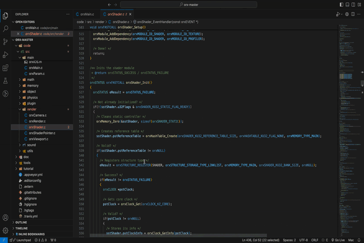

# 🌟 RigVe 🌟

# ‼️ Dependancy ‼️

This extension is not standalone; it depends on the RigVe server. You can find the details [here](https://raghava-ch.github.io/rigve-tool/).

## 🖥️ Unleashing the Beauty of Code

RigVe transforms complex code into visually stunning diagrams that are not just easy to understand but also a delight to look at. Whether you’re debugging, presenting, or exploring your code, RigVe turns every line into a work of art. 🎨
In the modern era of software development, understanding the intricate flow of code is essential. RigVe bridges the gap between abstract code and intuitive design by converting your code into meaningful, colorful diagrams that speak volumes at a glance.

## 📽️ Demo
### Nassi–Shneiderman Diagram

This will explains abot the function using NSD symbols and colors for similar colors for the same group symbols

## The Power of Visualization

In a world where a picture is worth a thousand words, RigVe takes it a step further—turning your code into a visual narrative that’s easy to understand, analyze, and share. Uncover patterns, identify bottlenecks, and streamline your development process with the power of visualization.

### ✨ Visual Clarity
Transform complex code structures into clear, visually engaging diagrams.

### 🔗 Seamless Integration
Works effortlessly with your existing codebase.

### 🎯 Who Is It For?
Whether you're a developer, a project manager, or an educator, RigVe offers value by simplifying code comprehension, making it easier to present complex ideas with simple visuals, or teaching programming concepts in an engaging way. It's especially valuable during knowledge transfer sessions with new employees, helping them quickly grasp complex codebases through visual representations.

## 🛤️ Roadmap for Diagrams Support

- [x] Nassi–Shneiderman Diagram
  - [x] Support all NSD symbols
    - [x] Implement new symbols for modern languages
    - [ ] Enable scoped visualization settings
    - [ ] Provide on-click navigation to source code
- [x] Other diagrams work in progress
## 🛠️ Roadmap for Programming Language Support
- [x] C
  - [ ] Pre-processing
- [x] Java
- [ ] Other languages

**Note:** Will decide next supporting language.
## 🚀 Installation And Usage
Follow the [link](https://raghava-ch.github.io/rigve-tool/).

For more details, please refer to the full [Documentation](https://raghava-ch.github.io/rigve-tool/).
If you are interested follow video the channel in [YOUTUBE 📹 ](https://www.youtube.com/@RigVe-tool)

(<a href="#readme-top">back to top</a>)

### Data Security:
This tool is not designed to collect data such as diagnostics, test results, crash reports, or personal identification. In other words, It should work on a local network of the computer. Found a bug please report issues in the [repo issues](https://github.com/Raghava-Ch/RigVe/issues) or [Discord](https://discord.gg/uAzAMSxD). Rest assured, all your data is processed in your personal environment safely.

**Note:** You may develope your own plugin for your favorite editor stating that direct depandancy with the RigVe tool.

(<a href="#readme-top">back to top</a>)

<!-- CONTACT -->
## 📞 Contact
Raghava CH
Email: ch.raghava44@gmail.com

Website: [RigVe Tool](https://raghava-ch.github.io/rigve-tool/)

(<a href="#readme-top">back to top</a>)
